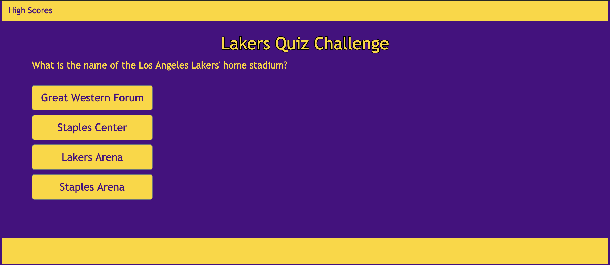

# CodeQuiz

The purpose of this application is to run a Los Angeles Lakers quiz.  The quiz begins when the user selects the "Start Quiz" button on the home page.  The quiz will then begin.  The user will have 60 seconds to answer 5 quesrtions about the Los Angeles Lakers in 60 seconds or less.  The user receives 10 points for each correct answer and an additional point for each second remaining on the clock upon completion.  The user will also be penalized 10 seconds for each question answered incorrectly.  Upon completing the quiz, the user's High Scores will be stored client-side and are accessible by pressing the "High Scores" button at the top of the page.   

